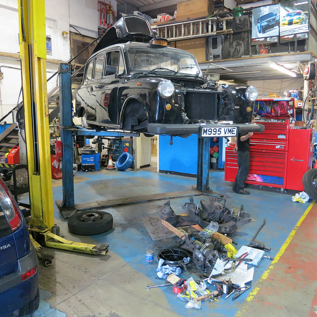

.. impress::
   :func: linear

========================
Nuka
========================

.. slide::
  :class: first

Libérez le devops qui est en vous

.. image:: ./images/pycon.svg
  :align: center

A propos
========

- Je suis Gael « `@gawel_ <https://twitter.com/gawel_>`_ » Pasgrimaud

- Je geek `@bearstech <https://twitter.com/bearstech_>`_

Histoire
========

.. slide::
  :class: bigs

- Hébergement et Infogérance libres depuis 2004

- script à la papa; svn...

- pussh https://github.com/bearstech/pussh

- choix d'outil de déploiement

Existant
========

.. slide::
  :class: bigs

- puppet

- chef

- salt

- ansible

Le choix
========

Photo by `Martin Fisch  <https://www.flickr.com/photos/marfis75/8031936764>`_, CC via Flickr

La douleur
===========

Photo by `Thomas Hawk <https://www.flickr.com/photos/thomashawk/6247423737/>`_, CC via Flickr

Le bricolage
============

Photo by `(Mick Baker)rooster  <https://flic.kr/p/foN1Ku>`_, CC via Flickr

You see the light
=================

Photo by `Stuart Williams  <https://flic.kr/p/5JcGgf>`_, CC via Flickr

DIY!
====

- python3

- asyncio

- ssh-agent && [ssh|asyncssh]

POC
======

- bas niveau (code)

- extensible

- builtin graphs

- testé

- 5k lignes de code (- 1.5k de taches courantes)

How it works (1/2)
==================

- Host

- Tasks

- coroutines

How it works (1/2)
==================

- setup: upload de base de code et récupération d'inventaire

- run

- teardown: nétoyage, rendu de graphs

Hosts
=====

- Host

- DockerContainer

- cloud (libcloud / openstack)

Task
=====

- trick: class locale != class distante

- appels shell

A task
=======

.. literalinclude:: ../tasks/__init__.py

Use it
======

.. literalinclude:: ../do_tasks.py

Known issues
============

- support debian. autres distro incertaines

- timeout sur un grand nombre de connections (> 150) en fonction du CPU/Net

- docker + systemd

